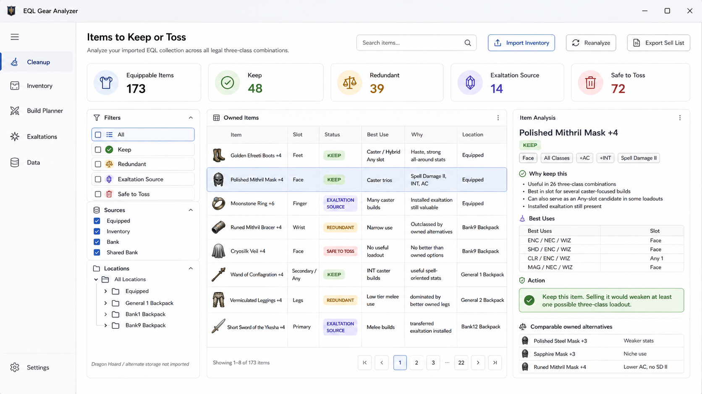
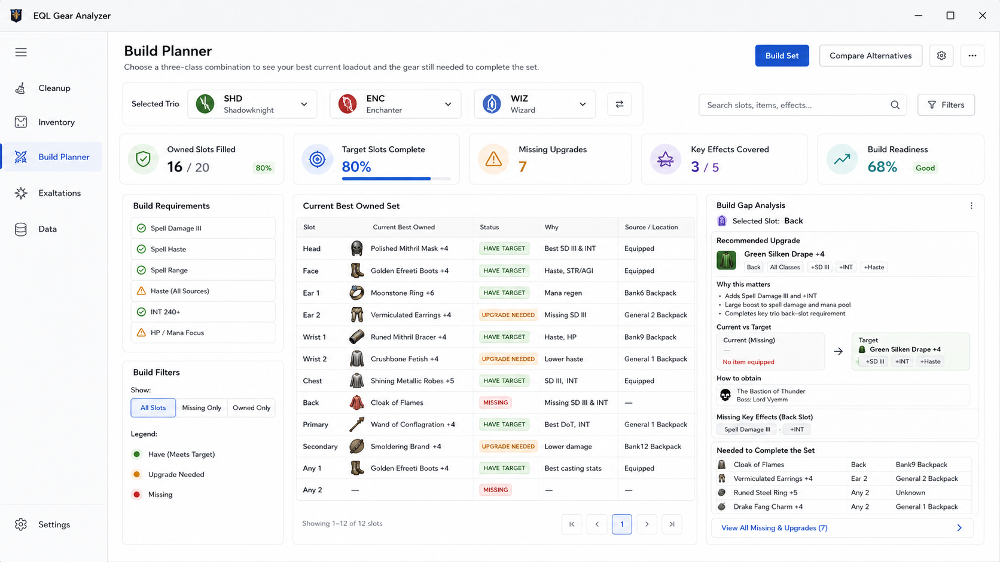

# EQL Gear Analyzer
## Product Requirements Document and UX Specification

**Status:** Product definition for implementation  
**Version:** 0.1  
**Date:** August 9, 2026  
**Primary audience:** Codex and application developers  
**Product owner:** James  
**Target platform:** C# WPF desktop application with a local SQLite database  
**Hosting model:** None. The application is local-first and has no product-owned backend.

---

## 1. Executive summary

EQL Gear Analyzer is a local Windows desktop application for EverQuest Legends players who own a large collection of equipment and Exaltations across equipped slots, inventory bags, bank bags, shared bank, and manually recorded alternate storage.

The application has two primary jobs:

1. **Collection cleanup:** Analyze every owned equippable item and Exaltation against every legal three-class combination, then explain which assets are useful, which are redundant because the player already owns better alternatives, and which are candidates to sell or discard.
2. **Build planning:** Let the player select any three-class combination, assemble the strongest complete set available from the player's collection, identify what is missing or materially below target, and recommend equipment or Exaltations to obtain to complete or improve the set.

The product must evaluate **complete equipment sets**, not isolated item scores. An item's value depends on the other items in the set, stat thresholds and diminishing returns, duplicate equipment positions, the two Any positions, class restrictions, installed and transferable Exaltations, effect stacking, and key build effects such as Spell Damage III, Spell Haste, Spell Range, melee Haste, and Ranger bow Haste.

The application must be conservative about disposal. It must never label an item as safe to discard merely because another item has larger raw numbers. It must first prove that the item provides no material benefit to any legal three-class build or valid specialized loadout, is not needed as a second copy for a duplicated equipment position, and does not contain or represent a valuable Exaltation.

The solution must explicitly follow Robert C. Martin's Clean Architecture. WPF Views, controllers, presenters, use cases, domain entities, and data gateways must remain separated by inward-pointing dependencies. SQLite, inventory-file parsing, and external catalog access are outer implementation details mapped onto interfaces owned by the application layer.

---

## 2. Product vision

> Give an EQL player a trustworthy, explainable answer to two questions: **What should I keep?** and **What should I obtain next for any three-class build?**

The application should feel like an inventory intelligence tool rather than a generic item database or static BiS list. It should understand the player's actual physical item instances, installed Exaltations, duplicate copies, item locations, and the opportunity cost of assigning an item or Exaltation to one build versus another.

---

## 3. Problem statement

EverQuest Legends creates a difficult equipment-management problem:

- A player can become any legal combination of three classes.
- An item that is weak for one trio may be important for another.
- An item that is not best in its native slot may still be optimal in one of the two Any positions.
- Ear, Ring/Finger, Wrist, and possibly other position types require multiple physical item copies.
- An item can be valuable because of a native, installed, or extractable Exaltation even when its base stats are obsolete.
- Exaltations can narrow the target item's allowed classes through class-set intersection.
- Stat value depends on the completed set. Extra CHA has little or no value after the target is reached; primary damage stats can lose marginal value near caps; HP, mana, endurance, AC, and resists become more important as other needs are satisfied.
- Key effects such as Spell Damage III, Spell Haste, Spell Range, and Haste can define the build and cannot be represented as ordinary additive stat points.
- The standard `/outputfile inventory` file exposes equipped gear, bags, bank, shared bank, nested contents, and installed Exaltations, but the supplied sample does not expose Dragon Hoard, Item Storage, or Exaltation Storage.
- The inventory output identifies owned assets but does not contain the complete item definitions required for analysis.

Existing tools provide useful catalog and tri-class search capabilities, but the required product is collection-centric: it must compare the player's complete owned collection across all builds, identify redundancy, and produce an actionable cleanup and acquisition plan.

---

## 4. Goals

### G-01 — Trustworthy cleanup
Identify items that have no material use and items whose uses are completely covered by better owned assets. Explain the evidence before recommending disposal.

### G-02 — Protect useful assets
Protect every item instance that materially improves at least one legal three-class loadout, fills a duplicated position, provides a key build effect, supports a valid specialized resist configuration, or contains a valuable native or installed Exaltation.

### G-03 — Build any trio
Allow explicit selection of any legal three-class combination and produce the best set currently available from the imported and manually maintained collection.

### G-04 — Complete the build
Compare the best owned set to a target set derived from the complete catalog and user-selected acquisition constraints. Identify missing equipment, missing Exaltations, required extractions, upgrades, and sources.

### G-05 — Explain every recommendation
Every Keep, Review, Extract Then Dispose, or Dispose Candidate result must have human-readable reasons. No recommendation may depend only on an opaque score.

### G-06 — Remain local and inexpensive
Run as a local WPF application with SQLite. Require no application-owned cloud service, user account, hosted API, or recurring infrastructure cost.

### G-07 — Be maintainable as EQL changes
Keep game rules, catalog source details, inventory parsing, UI presentation, and optimization logic separated so that updates do not require a rewrite of the application.

---

## 5. Non-goals

The first release will not:

- Sell, destroy, move, equip, socket, or extract items inside EQL.
- Automate the game client or read process memory.
- Host player inventories or builds on a product-owned server.
- Require login, account creation, subscriptions, or cloud synchronization.
- Treat the generated UI mock data as authoritative EQL item facts.
- Claim absolute disposal safety when catalog data, item state, storage coverage, or game rules are unresolved.
- Replace player judgment for encounter-specific tactics; it will explain assumptions and allow review.
- Build a full combat simulator in the initial release.

---

## 6. Product-owner decisions that are settled

These decisions are requirements and must not be reinterpreted without product-owner approval.

| ID | Decision |
|---|---|
| POD-01 | The Cleanup workflow analyzes **all legal three-class combinations automatically**. It must not ask the user to select or declare a current trio. |
| POD-02 | The Build Planner workflow explicitly lets the user select one three-class combination. |
| POD-03 | Item value is determined by contribution to a **complete equipment set**, not a fixed universal item score. |
| POD-04 | Every physical item copy is an individual owned item instance. One copy cannot occupy two positions. |
| POD-05 | There are two Any positions. Any otherwise equippable item may be assigned to either Any position. |
| POD-06 | Duplicate equipment positions must be modeled. The product owner has identified Ear ×2, Ring/Finger ×2, Wrist ×2, Bracer ×2, and Any ×2. Whether Wrist and Bracer are distinct EQL position names or two descriptions of the same position type must be validated; the application must not silently merge or discard either requirement. |
| POD-07 | DEX contributes zero utility to optimization. A proc may be valuable as an effect, but DEX receives no credit for proc frequency. |
| POD-08 | CHA has limited utility only until the completed character reaches approximately 80 CHA for classes/mechanics where CHA matters; additional CHA above the configured target contributes zero marginal utility. For classes with no meaningful CHA use, CHA contributes zero throughout. |
| POD-09 | HP, mana, endurance, AC, primary class damage stats, and individual resists must be assessed as whole-set totals with caps, thresholds, and diminishing returns where applicable. |
| POD-10 | Special effects and Exaltations such as Spell Damage III, Spell Haste, Spell Range, melee Haste, and Ranger bow Haste can be key build requirements and must not be reduced to trivial stat points. |
| POD-11 | Equippable items, loose Exaltations, native extractable Exaltations, and installed Exaltations are all owned assets that require assessment. |
| POD-12 | Exaltation class restrictions combine with target-item restrictions by set intersection. Installation is invalid when no allowed class remains. |
| POD-13 | An item's base-equipment usefulness, preservation reasons, and final recommended action are separate dimensions. “Exaltation Source” is not a mutually exclusive item status. |
| POD-14 | Quest-reward items are excluded from practical target recommendations by default unless the user explicitly enables them. Repeatable dropped items are preferred because upgrading quest rewards is often impractical. |
| POD-15 | The application architecture must explicitly follow Robert C. Martin Clean Architecture. |
| POD-16 | The desktop application uses C# WPF and a local SQLite database. Each user maintains their own local catalog and collection data. |

---

## 7. Personas and primary jobs

### Primary persona: experienced EQL player with a large collection

Characteristics:

- Understands EQL classes, effects, upgrades, and raids.
- Changes class combinations rather than committing to one permanent trio.
- Accumulates many upgraded items, duplicate items, and Exaltation donors.
- Needs fast, confident cleanup decisions without accidentally destroying a future build asset.
- Wants an actionable target list for a selected trio.
- Values detailed explanations and direct evidence over generic recommendations.

### Primary jobs to be done

1. “Show me which items in my known collection still make at least one build materially better.”
2. “Show me which items are obsolete because I already own enough better alternatives.”
3. “Show me which items have no meaningful equipment use.”
4. “Protect items that contain a valuable Exaltation, even if the item itself is obsolete.”
5. “For this selected trio, show me the strongest set I can build right now.”
6. “Show me what I need to acquire, extract, or rearrange to complete that trio's set.”
7. “Tell me exactly where each owned item is located so I can act in game.”

---

## 8. Product principles

### PR-01 — Whole-set reasoning
The optimizer evaluates the resulting character and complete loadout. It does not rank every item independently and assemble the highest isolated scores.

### PR-02 — Explainability before certainty
A recommendation is only as strong as the evidence behind it. The UI must expose the relevant build, assigned position, requirements satisfied, comparison alternatives, and data-confidence limitations.

### PR-03 — Conservative disposal
Unknown data, unresolved class restrictions, unclassified effects, incomplete Exaltation state, or missing catalog definitions prevent a “safe” disposal recommendation.

### PR-04 — Physical-copy awareness
The application reasons about actual copies and their current installed state. Catalog item identity alone is insufficient.

### PR-05 — Effects are set capabilities
A build needs one adequate source of a non-stacking key effect, not the maximum number of items with that effect. Once satisfied, duplicate non-stacking effects receive little or no additional value.

### PR-06 — Local-first operation
Catalog and inventory data remain local. Network access is limited to user-initiated or configured catalog synchronization from external sources.

### PR-07 — Rules are versioned knowledge
EQL mechanics may change or remain uncertain. Rules must be traceable to a ruleset version and must be changeable without corrupting historical imports.

### PR-08 — Source mocks are conceptual
The included screenshots define layout, information hierarchy, and visual direction. Their sample item-to-slot assignments and sample item facts are illustrative and must not override catalog data or domain rules.

---

## 9. Scope and release priorities

### P0 — Required for the first useful release

- Local application shell and first-run setup.
- Full local catalog synchronization or import.
- EQL inventory-file import.
- Parsing of nested bags, bank, shared bank, upgrade levels, duplicate copies, and installed Exaltation rows.
- Manual collection additions for storage not represented in the output file.
- Collection coverage and data-health reporting.
- Cleanup analysis across every legal trio.
- Item usefulness, redundancy, preservation reasons, and final-action recommendations.
- Detailed item explanation with useful class combinations and assigned positions.
- Build Planner for one selected trio.
- Best owned loadout, target loadout, build requirements, gaps, and acquisition recommendations.
- Exaltation compatibility and extraction analysis.
- Exportable disposal list sorted by in-game location.
- Local SQLite persistence, migrations, backup, and recovery.

### P1 — Strong follow-up capabilities

- File watching and one-click re-import after `/outputfile inventory`.
- Inventory snapshot comparison: new, moved, upgraded, missing, and Exaltation changes.
- Saved trio builds and comparison between builds.
- Manual item protection/lock and user rule overrides.
- Alternative target plans optimized for ease of acquisition, raid source, or specific resist objectives.
- Catalog import/export package for offline sharing.

### P2 — Future possibilities

- Multiple character or account profiles.
- Automated Dragon Hoard or alternate-storage import if EQL exposes a safe supported source.
- Rich item icons where a reliable licensed source exists.
- Community-shareable ruleset packages without any hosted player-data service.
- More detailed weapon and encounter simulation after EQL-specific mechanics are verified.

---

## 10. Ubiquitous language and glossary

| Term | Definition |
|---|---|
| Catalog Item | Canonical EQL definition of an item, independent of whether the player owns it. |
| Owned Item Instance | One physical copy of a catalog item, with its own upgrade level, location, and installed Exaltations. |
| Exaltation Definition | Canonical definition of a transferable Focus, Clicky, Worn, Proc, or other supported Exaltation effect. |
| Owned Exaltation Instance | One loose or installed copy of an Exaltation owned by the player. |
| Native Exaltation | An Exaltation originally present on its source item. |
| Installed Exaltation | An Exaltation currently socketed in an owned item. It may be native or transferred from a different source item. |
| Effective Allowed Classes | The class set remaining after intersecting the base item's restrictions with all installed Exaltation restrictions. |
| Class Combination / Trio | An unordered set of exactly three distinct legal EQL classes. |
| Slot Type | A catalog item's native compatible slot category, such as Face, Back, Ear, or Wrist. |
| Equipment Position | A concrete position in a complete loadout, such as Ear 1, Ear 2, Any 1, or Any 2. |
| Any Position | One of two special positions that can accept any otherwise equippable item instance. |
| Build | A selected three-class combination together with its stat objectives, effect requirements, constraints, and target policy. |
| Loadout | A complete assignment of item instances or target item configurations to equipment positions. |
| Best Owned Loadout | Highest-utility valid loadout that can be assembled from the known owned collection under the active ruleset. |
| Target Loadout | Desired complete loadout selected from the catalog under acquisition and upgrade constraints. |
| Build Requirement | A stat threshold or effect capability the completed build needs or strongly prefers. |
| Requirement Coverage | Whether a specific loadout satisfies, partially satisfies, misses, or cannot evaluate a requirement. |
| Build Gap | A difference between the best owned loadout and the target or required state. |
| Useful | The item's base equipment state materially contributes to at least one valid build/profile. |
| Redundant | The item could be useful in theory, but the known collection covers every meaningful use with equal or better alternatives. |
| No Useful Build | The base item produces no material equipment benefit for any evaluated legal build/profile. |
| Preservation Reason | A reason the asset must remain even if its base item is redundant, such as a key Exaltation or saved-build dependency. |
| Final Action | Keep, Needs Review, Extract Then Dispose, or Dispose Candidate. |
| Material Improvement | An improvement large enough to matter under configured comparison tolerance; tiny numerical differences must not preserve an item indefinitely. |
| Collection Coverage | Which storage sources are known complete, known empty, manually maintained, or unavailable. |
| Ruleset | Versioned EQL mechanics and product-owner valuation rules used for analysis. |

---

## 11. Source evidence and current constraints

### 11.1 Supplied inventory fixture

The included sample file is `samples/Parnell_oggok-Inventory.txt`.

Observed properties of this fixture:

- Tabular columns: Location, Name, ID, Count, and Slots.
- Equipped positions are represented directly.
- General inventory bags and nested bag slots are represented as hierarchical location paths.
- Bank bags and nested contents are represented.
- Shared Bank positions are represented.
- Upgrade levels are encoded in item names, such as `+4` or `+6`.
- Empty child/socket rows are represented explicitly.
- Installed Exaltations are represented as subordinate rows whose names contain `(Exaltation)`.
- Native installed Exaltations can reuse the base item ID.
- Transferred Exaltations can have a different item ID than the host item.
- The fixture contains 778 data rows, 205 non-empty rows, and 20 installed Exaltation rows.
- The fixture ends after Shared Bank and a KeyRing header. It contains no Dragon Hoard, Item Storage, or Exaltation Storage locations.

Representative evidence:

- `Face-Slot7` contains `Polished Mithril Mask (Exaltation)` under `Polished Mithril Mask +4`.
- `Bank9-Slot5-Slot8` contains `Boots of the Long Road (Exaltation)` under `Pristine Studded Leather Boots +4`, demonstrating a transferred Exaltation with a different source ID.
- One `Short Sword of the Ykesha +4` has an empty subordinate slot while another contains `Shimmering Ruby Stiletto (Exaltation)`, demonstrating that physical copies of the same base item can have different current states.

### 11.2 External catalog candidate

The preferred catalog candidate is **EQ Legends Tools**, particularly:

- https://eqlegendstools.com/bis-gear/
- https://eqlegendstools.com/char-sheet/
- https://eqlegendstools.com/focus-effects/

As observed on August 9, 2026, the site provides tri-class gear search, slot filtering, upgrade-scale controls, stat thresholds, source/effect search, a character sheet that imports `/outputfile inventory`, and Exaltation planning. It documents current extraction prerequisites of +1 for Focus, +2 for Clicky, +3 for Worn, and +4 for weapon Proc Exaltations, together with same-slot/shared-class compatibility rules.

No documented public API or complete downloadable catalog has yet been confirmed. Programmatic access, item-ID availability, source permission, and rate limits remain a required technical and product-data discovery item.

The EQ Legends Tools Character Sheet implementation was inspected on August 10, 2026. Its browser bundle loads curated planner data from the first-party `/api/char-sheet-data` endpoint, imports the same local `/outputfile inventory` file, applies a weighted item-score algorithm for a selected tri-class and favored stats, and supports local JSON profile backup/export. Direct requests to that endpoint are rejected as available only to the EQ Legends Tools site. This endpoint is therefore **not** a public catalog API and must not be scraped, mirrored, or used as an application data dependency without explicit permission from its operator.

### 11.3 Source-of-truth hierarchy

Until a formal source agreement exists, the application should use this hierarchy:

1. **Inventory import and manual collection state** are authoritative for what the player currently owns, where it is, its upgrade level, and which Exaltations are actually installed.
2. **Normalized local catalog** is authoritative for canonical item statistics, classes, slot restrictions, effects, sources, and upgrade behavior.
3. **Versioned game ruleset** is authoritative for stat utility, effect priorities, stacking, equipment-position rules, and Exaltation compatibility.
4. **User overrides** are authoritative only for the user's local analysis and must be visibly marked.

The application must never infer that an item still contains its catalog-native Exaltation when the imported socket row is empty.

### 11.4 Permitted catalog compilation and provenance

The product may compile a normalized, portable local catalog package from one or more external data sources when all of the following conditions hold:

1. The source's license, terms, or written permission permits the intended retrieval, normalization, local storage, and derivative catalog use.
2. The compiler observes the source's published access controls, robots policy, authentication boundary, and rate limits. A first-party endpoint restricted to its own site is not permission to access or reuse its data.
3. Each compiled package records a provenance manifest containing source name, canonical URL, permission or license basis, retrieval timestamp, source version when available, content hash, compiler/parser version, and completeness/confidence notes.
4. Raw source payloads are not redistributed or bundled unless their license or permission explicitly permits redistribution. The portable package contains only the normalized facts allowed by that permission and required by this product.
5. Failed, incomplete, ambiguous, or unlicensed source records remain visible as unresolved data; they must not become confident disposal recommendations.

The application shall support two distinct acquisition modes:

- **User-provided catalog package:** an offline package the user has the right to import. The application validates its manifest and preserves the declared provenance.
- **Authorized compiler source:** a configured source with an explicit permission basis. Compilation is reproducible, rate-limited, auditable, and produces the same portable package format as user-provided import.

This policy permits a future compiler comparable in architecture to a curated character-sheet planner, but does not authorize copying EQ Legends Tools' internal dataset or bypassing its endpoint restrictions.

---

## 12. Information architecture

### 12.1 Primary navigation

The application has five primary work areas.

| Area | Primary question |
|---|---|
| Cleanup | Which owned assets should I keep, review, extract, sell, or discard? |
| Inventory | What do I own, where is it, and what is installed in it? |
| Build Planner | For a selected trio, what is my best owned set and what should I obtain? |
| Exaltations | Which Exaltations do I own, where are they, and which builds or target items can use them? |
| Data | Is my catalog, collection, storage coverage, and ruleset complete and current? |

Settings may appear at the bottom of the navigation rail but is not a primary use-case area.

### 12.2 Global application shell

The shell must provide:

- Persistent left navigation.
- Current catalog version and last-sync health accessible from Data and optionally from a global status indicator.
- Current inventory snapshot timestamp.
- Active collection/profile name.
- Non-blocking progress for catalog synchronization and analysis.
- Clear warnings when collection coverage or catalog data is incomplete.
- Keyboard-accessible navigation and commands.

### 12.3 Global status dimensions

The UI must not collapse all analysis into one color or label. Every item can have three distinct dimensions.

#### Equipment usefulness

- Useful
- Redundant
- No Useful Build
- Unknown

#### Preservation reasons

Zero or more badges:

- Best Owned for Build
- Competitive Alternative
- Key Build Effect
- Native Exaltation Source
- Installed Valuable Exaltation
- Specialized Resist Value
- Duplicate-Position Need
- Used in Saved Build
- Manually Protected
- Unknown/Unresolved Data

#### Final action

- **Keep** — disposal would materially weaken a valid build or lose a preserved asset.
- **Needs Review** — evidence is incomplete, close, or assumption-sensitive.
- **Extract Then Dispose** — base item is not needed, but a valuable extractable Exaltation must be retained first.
- **Dispose Candidate** — no material equipment or Exaltation use remains under the current known collection and ruleset.

“Safe to Toss” may be used as friendly UX wording only when confidence is complete. When coverage is partial, the label must say “Dispose Candidate within known collection” or equivalent.

### 12.4 Confidence state

Each recommendation has one of these confidence states:

- **Complete:** catalog definition, item state, applicable rules, and required storage coverage are known.
- **Partial:** recommendation is supported but one or more non-critical sources are incomplete.
- **Blocked:** missing or contradictory data prevents a trustworthy recommendation.

Color must never be the only carrier of status. Text and icons are required.

---

## 13. UX visual direction

The included mocks establish the intended visual language:

- Professional light-theme Windows desktop application.
- Spacious but information-dense layout suitable for a power user.
- Persistent left navigation.
- Summary cards across the top.
- Filter panel, primary grid, and contextual details panel.
- Rounded panels, subtle borders, restrained shadows, and compact status badges.
- Tables optimized for scanning, sorting, and keyboard selection.
- Consistent green, amber, purple/blue, and red semantics, always paired with text/icon labels.

The application should remain usable at common Windows scaling levels from 100% through 200%. Lists and grids must virtualize large collections. The details pane may collapse below or into a tab/drawer when the window becomes narrow.

---

## 14. UX specification — Cleanup

> **Mock caveat:** Layout and information hierarchy are authoritative design direction. Sample item facts, icons, counts, slots, and status combinations are illustrative. The specification below overrides any inconsistent sample content in the image.

### 14.1 Purpose

Answer these collection-wide questions without requiring a selected trio:

1. Does this owned item or Exaltation have any material use across all legal three-class combinations?
2. Is this asset redundant because the player already owns enough better alternatives?
3. Which builds and equipment positions make it useful?
4. Is its preservation based on base equipment, a key effect, an installed Exaltation, or an extractable Exaltation?
5. What action should the player take?

### 14.2 Page header

Must contain:

- Title: **Items to Keep or Toss** or **Cleanup**.
- Subtitle explaining that all legal three-class combinations are analyzed.
- Search across item name, effect, Exaltation, slot, source, and location.
- Import Inventory action.
- Reanalyze action.
- Export Disposal List action.
- Visible snapshot timestamp and analysis ruleset version.

### 14.3 Summary cards

Required summary metrics:

- Equippable owned item instances.
- Useful base items.
- Redundant base items.
- No Useful Build items.
- Items protected by Exaltations or key effects.
- Keep count.
- Needs Review count.
- Extract Then Dispose count.
- Dispose Candidate count.
- Unknown/unresolved count.

The UI may show a subset as top cards and place the remainder in an expandable summary. Counts must be calculated from item instances, not distinct catalog item definitions.

### 14.4 Filter and scope panel

Filters must include:

- Final action.
- Equipment usefulness.
- Preservation reason.
- Confidence.
- Slot type.
- Assigned best-use position.
- Class or class-combination relevance.
- Key effect or Exaltation category.
- Storage source.
- Nested physical location.
- Upgrade level range.
- Catalog resolution state.
- Manual-protection state.

Storage scope must show coverage, not merely checkboxes. Examples:

- Equipped — Imported
- Inventory — Imported
- Bank — Imported
- Shared Bank — Imported
- Dragon Hoard — Not imported
- Item Storage — Manually maintained or Not imported
- Exaltation Storage — Manually maintained or Not imported

Unknown storage must be visible at normal reading size, not hidden as an insignificant footnote.

### 14.5 Owned-items grid

Each row represents one Owned Item Instance.

Required columns or equivalent row content:

- Item name and upgrade level.
- Native slot type.
- Current physical location.
- Equipment usefulness.
- Final action.
- Preservation badges.
- Number of legal trios/build profiles in which it is materially useful.
- Best-use summary.
- Short explanation.
- Confidence.

Sorting must support at least:

- Final action.
- Physical location.
- Slot.
- Number of useful builds.
- Upgrade level.
- Item name.
- Confidence.

The same catalog item appearing multiple times must have separate rows when physical instances differ.

### 14.6 Item-analysis details pane

Selecting a row opens a detailed explanation containing:

#### Identity and current state

- Base item identity and numeric item ID.
- Upgrade level.
- Physical location and container path.
- Native allowed classes.
- Native compatible slots.
- Installed Exaltations and socket positions.
- Effective allowed classes after all intersections.
- Raw stats, resists, weapon attributes, and effects.

#### Usefulness explanation

- Equipment usefulness classification.
- Final action.
- Confidence and any blockers.
- Every preservation reason.
- Number of legal trios and analysis profiles where the item is used.
- Top representative uses, each showing trio, equipment position, loadout profile, and why it contributes.
- Whether the item is best-owned, near-equivalent, or specialized.

#### Whole-set explanation

The explanation must show set context, such as:

- “CHA receives no additional credit because the completed loadout already reaches the configured target.”
- “This item remains useful because it supplies HP and mana after INT reaches its high-value range.”
- “This is assigned to Any 2 because a different item is more valuable in its native Face position.”
- “This is the second-best Ring instance but is still required because the loadout has two Ring positions.”
- “This item supplies the only compatible melee Haste source for these trios.”

#### Exaltation analysis

For each native or installed Exaltation:

- Type and tier.
- Effect category.
- Extraction eligibility at the current upgrade level.
- Required slot compatibility.
- Allowed classes.
- Whether it is native or transferred.
- Builds for which it is key or useful.
- Candidate target items, if available.
- Class-coverage impact if transferred.

#### Owned alternatives

List owned alternatives that compete for the same native or Any positions. Explain:

- Why the selected item wins in some sets.
- Why another item wins in others.
- Whether the selected item remains necessary as a second copy.
- Whether all uses are covered without it.

### 14.7 Cleanup actions

Available actions:

- Protect/Lock item locally.
- Clear manual protection.
- Add a note.
- View all useful builds.
- Open Build Planner for a selected representative trio.
- View Exaltation details.
- Add to disposal export.
- Exclude from disposal export.
- Mark physical state as manually corrected.

The application must never silently delete local collection records or imply it changed the game inventory.

### 14.8 Export Disposal List

The export must be actionable in game and include:

- Item name and upgrade level.
- Quantity/instance count.
- Exact physical location and container path.
- Recommended action.
- Whether Exaltation extraction is required first.
- Concise reason.
- Confidence and coverage warning.

Default sort order is physical location, then container slot, to minimize in-game searching.

---

## 15. UX specification — Build Planner

> **Mock caveat:** Layout and hierarchy are design direction. Sample item-to-slot assignments and item facts are not authoritative. A generated mock may place an item in an impossible or inaccurate slot; the application must always follow catalog and ruleset data.

### 15.1 Purpose

For one explicitly selected legal trio, answer:

1. What is the strongest complete set that can be built from the known owned collection?
2. Which key stats and effects does that set satisfy or miss?
3. What is the target complete set under the selected acquisition and upgrade constraints?
4. Which equipment, Exaltations, extractions, or rearrangements are needed to reach the target?
5. Where can those missing assets be obtained?

### 15.2 Trio selector

Requirements:

- Exactly three distinct classes.
- Order does not change combination identity.
- Illegal combinations, if any exist in EQL, cannot be selected.
- Class search and keyboard selection.
- Recently used and saved combinations.
- Changing any class invalidates and recalculates the current projections.
- The selector may show class names and abbreviations.

### 15.3 Build policy and advanced filters

The planner must expose or persist these policies:

- Target item upgrade level assumption.
- Actual owned upgrade levels are always used for owned items.
- Maximum level-to-obtain filter.
- Include/exclude quest rewards; default exclude.
- Include/exclude raid sources.
- Include/exclude specific zones, bosses, source types, or difficulties when available.
- Practical target versus unrestricted theoretical target.
- General/balanced build versus specialized resist or role profile.
- Manual requirement overrides.
- Material-improvement tolerance.

Advanced filters may be collapsed by default but must remain discoverable.

### 15.4 Build summary

Required summary concepts:

- Positions filled with valid owned equipment.
- Positions that meet target.
- Positions with an upgrade available.
- Positions truly missing.
- Critical requirements satisfied.
- Strongly preferred requirements satisfied.
- Unknown or blocked requirements.
- Build readiness.

If a Build Readiness percentage is displayed, the UI must provide a definition and breakdown. It cannot be an unexplained decorative score.

### 15.5 Build Requirements panel

Each requirement displays:

- Name, such as Spell Damage III, Spell Haste, Spell Range, melee Haste, bow Haste, INT target, HP target, mana target, or resist target.
- Priority: Critical, Strongly Preferred, Beneficial.
- Coverage: Satisfied, Partial, Missing, Unknown.
- Source item(s) and Exaltation(s) in the current loadout.
- Stacking or cap explanation.
- Effect of satisfying the requirement.

Requirements belong to the complete build. They are not tied permanently to a single equipment position.

### 15.6 Best Owned Loadout panel

The main grid lists every Equipment Position, including duplicated and Any positions.

Required columns or equivalent content:

- Equipment Position.
- Assigned Owned Item Instance.
- Item upgrade level.
- Installed Exaltations.
- Position status.
- Why selected.
- Current physical location.
- Requirements contributed.
- Confidence.

Position statuses:

- **Target Met:** the current assignment satisfies the target policy for this loadout.
- **Usable — Upgrade Available:** a valid owned item fills the position, but a material target improvement exists.
- **Missing:** no known owned item can validly fill the position or satisfy the minimum build need.
- **Blocked/Unknown:** data prevents evaluation.

The UI must not label an occupied position “Missing.” It must distinguish “owned but below target” from “no valid owned item.”

### 15.7 Complete-set stat and effect view

The planner must provide a view of resulting totals and thresholds:

- HP.
- Mana.
- Endurance where present and relevant.
- AC.
- STR, STA, AGI, DEX, WIS, INT, CHA.
- Each resist independently.
- Weapon damage/delay and relevant derived weapon indicators.
- Key effects and tiers.
- Threshold/cap status.
- Which item assignments contribute to each total or effect.

DEX may be displayed as a factual stat but receives zero utility in the default product-owner ruleset.

### 15.8 Target Loadout

The target is a complete valid set, not an independent “best item per slot” list.

The optimizer must account for interactions such as:

- An item is better in Any 1 while another item fills its native slot.
- A lower-stat item is chosen because it supplies a missing key effect.
- Additional CHA receives no credit after the set target.
- A high-INT item allows another position to prioritize HP, mana, endurance, AC, or resists.
- An Exaltation improves one item but narrows its class coverage.
- The same physical copy cannot appear twice.
- Lore/unique and hand/weapon restrictions prevent invalid combinations.

### 15.9 Build Gap Analysis

Each gap has:

- Gap type.
- Severity/priority.
- Current state.
- Target state.
- Requirements affected.
- Candidate solutions.
- Full-loadout improvement, not just isolated item delta.
- Acquisition source.
- Exaltation and class-compatibility implications.

Gap types:

- Missing Equipment.
- Equipment Quality.
- Stat Threshold.
- Key Effect.
- Exaltation.
- Extraction.
- Compatibility.
- Upgrade Level.
- Unknown Data.

### 15.10 Recommended upgrade detail

Selecting a position or gap shows:

- Current owned assignment or “none.”
- Recommended target assembled configuration.
- Alternative candidates.
- Before/after whole-set totals.
- Requirements newly satisfied.
- Requirements or class coverage lost.
- Whether the recommendation consumes or relocates an owned Exaltation.
- Whether the source item must be upgraded before extraction.
- Where and how the item or donor is obtained.
- Why the recommendation wins over alternatives.

### 15.11 Build Completion Plan

This is an actionable list containing zero or more of:

- Items to obtain.
- Exaltation source items to obtain.
- Loose Exaltations already owned and available.
- Native Exaltations to extract.
- Existing items to move from bank or bags.
- Existing items to place in different equipment positions.
- Existing installed Exaltations to move, when allowed.
- Upgrade levels required before extraction or target comparison.
- Unresolved data requiring review.

The plan must group recommendations that solve multiple gaps and rank by expected whole-build improvement. It should also expose practical alternatives when the theoretical best item is difficult to obtain.

### 15.12 Compare Alternatives

The user can compare at least two candidate plans or assignments by:

- Final stats.
- Requirement coverage.
- Key effects.
- Acquisition burden.
- Source restrictions.
- Exaltation consumption and class-coverage changes.
- Number of new items required.

Comparison must remain explanatory rather than showing only a final numeric score.

---

## 16. UX specification — Inventory

### 16.1 Purpose

Answer: “What do I own, where is it, and what is installed in it?”

### 16.2 Views

The Inventory area should support two complementary projections.

#### Physical storage view

- Equipped positions.
- General inventory positions.
- Bags rendered as nested containers or expandable bag cards.
- Bank bags.
- Shared Bank.
- Manually maintained Dragon Hoard, Item Storage, and Exaltation Storage.
- Aggregate badges on each bag showing Keep, Review, Extract, and Dispose Candidate counts.

#### Flat searchable inventory view

- All assets in a sortable grid.
- Filters for equipment, Exaltations, consumables, keys, materials, and unresolved assets.
- Direct navigation to physical location.

### 16.3 Item indicators

Every equippable item may display compact indicators for:

- Final action.
- Key Exaltation.
- Best-owned use.
- Unknown data.
- Manual protection.

Indicators must not obscure the item name or depend only on color.

### 16.4 Manual alternate-storage management

Because the supplied inventory output omits alternate storage, the user must be able to:

- Add an owned item instance by catalog search or item ID.
- Add a loose Exaltation.
- Assign a manual location such as Dragon Hoard, Item Storage, or Exaltation Storage.
- Set upgrade level.
- Record installed Exaltations if necessary.
- Edit or remove manually maintained records.
- Distinguish imported records from manual records.
- Preserve manual records across normal inventory-file imports.

---

## 17. UX specification — Exaltations

### 17.1 Purpose

Answer:

- Which Exaltations do I own?
- Which are loose, native, installed, transferred, extractable, or already absent?
- Which builds need them?
- Which owned or target items can accept them?
- What class restrictions result from socketing them?

### 17.2 Primary projections

- All owned Exaltation instances.
- Installed Exaltations grouped by host item.
- Loose Exaltations grouped by storage location.
- Extractable native Exaltations grouped by current upgrade eligibility.
- Key build Exaltations.
- Unused or redundant Exaltations.

### 17.3 Exaltation detail

Must show:

- Type, effect, and tier.
- Source item.
- Current state and location.
- Required item slot.
- Allowed classes.
- Extraction upgrade requirement.
- Candidate host items.
- Effective allowed classes for each candidate.
- Legal/illegal compatibility explanation.
- Builds where the effect is Critical, Strongly Preferred, Beneficial, or irrelevant.
- Stacking group and whether a higher tier already covers the need.

### 17.4 Socket-planning warning

Before recommending installation, the UI must show:

- Host item's current class coverage.
- Exaltation class coverage.
- Resulting intersection.
- Builds or saved loadouts that would lose access.
- Whether another copy of the host item exists.

---

## 18. UX specification — Data and first-run setup

### 18.1 First-run flow

1. Explain that the app is local-only and requires a catalog plus an inventory import.
2. Initialize or import a local catalog.
3. Display catalog version, source, and completeness.
4. Import an EQL inventory output file.
5. Show parsed storage coverage and unknown catalog items.
6. Offer manual alternate-storage entry.
7. Run initial analysis with progress and cancellation.
8. Open Cleanup with a visible confidence summary.

### 18.2 Data Health dashboard

Must show:

- Local database path and size.
- Catalog source and version.
- Last successful catalog sync.
- Ruleset version.
- Last inventory snapshot.
- Number of resolved and unresolved item IDs.
- Number of unresolved effects or Exaltations.
- Storage coverage.
- Manual records count.
- Data warnings and corrective actions.

### 18.3 Catalog maintenance actions

- Refresh catalog.
- Import catalog package.
- Export catalog package.
- Rebuild local catalog cache.
- Review source attribution.
- Resolve unmatched item IDs/names.
- View changes before applying a large catalog update.

### 18.4 Inventory maintenance actions

- Import new snapshot.
- Review import warnings.
- Revert to prior successful snapshot.
- Compare snapshots.
- Manage manual storage records.
- Export diagnostics.

---

## 19. Primary user journeys

### Journey A — Clean up bags and bank

1. User runs `/outputfile inventory` in EQL.
2. User imports the file.
3. Application resolves item IDs and installed Exaltations against the local catalog.
4. Application reports storage coverage and unresolved data.
5. Application analyzes all legal trios and valid build profiles.
6. User filters to Dispose Candidate.
7. User selects each item and reviews why it is redundant or has no useful build.
8. User excludes any item they want to protect manually.
9. User exports a disposal list sorted by physical location.
10. User sells or discards items manually in EQL.

### Journey B — Preserve an obsolete Exaltation donor

1. Cleanup shows a base item as Redundant or No Useful Build.
2. Preservation badge shows Key Exaltation Source.
3. Final action is Extract Then Dispose or Keep.
4. Details show extraction upgrade prerequisite, compatible classes, slot, and target builds.
5. User does not discard the donor before extraction.

### Journey C — Build a selected trio from owned gear

1. User opens Build Planner.
2. User selects three distinct classes.
3. Application derives build requirements.
4. Application assigns owned item instances to every valid equipment position.
5. User reviews final stats, effects, thresholds, and physical item locations.
6. User sees positions that meet target, need upgrades, are missing, or are blocked.

### Journey D — Complete a trio

1. Application compares Best Owned Loadout to Target Loadout.
2. Build Gap Analysis identifies missing items, effects, and Exaltations.
3. User selects a gap.
4. Application shows target and practical alternatives, acquisition sources, and full-set impact.
5. Build Completion Plan ranks items and Exaltation donors to obtain.
6. User exports or saves the plan.

### Journey E — Add Dragon Hoard assets manually

1. Data Health shows Dragon Hoard as not imported.
2. User searches the catalog and adds owned instances to a manual Dragon Hoard location.
3. User records upgrade level and Exaltations.
4. Application reanalyzes the collection.
5. Recommendations identify that the coverage is manually maintained rather than file-imported.

---

## 20. Functional requirements

### 20.1 Catalog acquisition and normalization

| ID | Priority | Requirement |
|---|---:|---|
| FR-CAT-001 | P0 | The application shall maintain a local normalized catalog of EQL item definitions and Exaltation definitions. |
| FR-CAT-002 | P0 | Catalog records shall be keyed by stable EQL numeric item ID when available. |
| FR-CAT-003 | P0 | When an external source lacks a usable item ID, the application shall support normalized-name matching and a persistent alias/mapping resolution. |
| FR-CAT-004 | P0 | Catalog synchronization shall be independent of player inventory import. |
| FR-CAT-005 | P0 | The application shall display catalog source, version, retrieval date, and completeness. |
| FR-CAT-006 | P0 | The application shall preserve source attribution and comply with source permission, access-boundary, robots-policy, and rate-limit requirements. |
| FR-CAT-007 | P0 | The application shall cache normalized data locally so core analysis works offline after synchronization. |
| FR-CAT-008 | P0 | Unknown catalog items or effects shall be visible and shall block confident disposal recommendations for affected assets. |
| FR-CAT-009 | P1 | The application shall support importing and exporting a portable catalog package. |
| FR-CAT-010 | P1 | The application shall show catalog changes that could alter prior analysis results. |
| FR-CAT-011 | P1 | The application shall support reproducible compilation of a portable catalog package from an authorized source, recording the provenance manifest defined in Section 11.4. |

### 20.2 Required catalog item data

Each equippable item definition must support, when available:

- Numeric item ID and normalized name.
- Native slot types.
- Allowed classes.
- Base and upgrade-scaled HP, mana, endurance, AC, primary stats, and individual resists.
- Weapon type, hand restrictions, damage, delay, range behavior, and other relevant weapon characteristics.
- Native Focus, Clicky, Worn, Proc, Haste, Spell Haste, Spell Damage, Spell Range, and other effects.
- Exaltation definitions linked to native effects.
- Lore/unique, no-drop, magic, quest, raid, and other relevant flags.
- Acquisition source type, zone, mob/NPC, quest, raid/difficulty when available, and level to obtain.
- Upgrade scaling and extraction prerequisites.
- Data source and confidence/provenance.

### 20.3 Inventory import

| ID | Priority | Requirement |
|---|---:|---|
| FR-INV-001 | P0 | The application shall import the tab-delimited EQL `/outputfile inventory` format. |
| FR-INV-002 | P0 | The importer shall preserve the full hierarchical location path. |
| FR-INV-003 | P0 | The importer shall distinguish containers, container contents, equipment, consumables, keys, materials, empty rows, and installed Exaltation rows. |
| FR-INV-004 | P0 | The importer shall parse base item name and upgrade level while preserving the original imported text. |
| FR-INV-005 | P0 | The importer shall create separate owned item instances for separate physical copies. |
| FR-INV-006 | P0 | The importer shall associate subordinate installed Exaltation rows with the correct host item instance. |
| FR-INV-007 | P0 | The importer shall preserve the installed Exaltation's own item ID so native and transferred Exaltations can be distinguished. |
| FR-INV-008 | P0 | Explicit empty socket rows shall be treated as known empty, not unknown. |
| FR-INV-009 | P0 | Import shall be transactional. A failed import shall not corrupt or partially replace the last successful snapshot. |
| FR-INV-010 | P0 | Import warnings shall identify unrecognized rows, unresolved items, duplicate ambiguities, and malformed paths. |
| FR-INV-011 | P0 | A successful import shall create a timestamped collection snapshot. |
| FR-INV-012 | P1 | The user shall be able to compare the current and previous snapshots. |
| FR-INV-013 | P1 | The application shall optionally watch for a newly generated inventory file and prompt to import it. |

### 20.4 Collection coverage and manual state

| ID | Priority | Requirement |
|---|---:|---|
| FR-COL-001 | P0 | The application shall track coverage separately for Equipped, Inventory, Bank, Shared Bank, Dragon Hoard, Item Storage, Exaltation Storage, and future storage types. |
| FR-COL-002 | P0 | Coverage states shall include Imported, Manually Maintained, Known Empty, Not Available, and Unknown. |
| FR-COL-003 | P0 | The user shall be able to add, edit, and remove manually maintained owned item and Exaltation instances. |
| FR-COL-004 | P0 | Manual records shall survive subsequent file imports unless the user explicitly removes or reconciles them. |
| FR-COL-005 | P0 | Imported and manual records shall be visibly distinguishable. |
| FR-COL-006 | P0 | Analysis output shall include a coverage/confidence qualification. |
| FR-COL-007 | P1 | The user shall be able to protect an item from disposal recommendations and attach a note. |

### 20.5 Collection-wide analysis

| ID | Priority | Requirement |
|---|---:|---|
| FR-ANA-001 | P0 | Cleanup analysis shall generate every legal unordered three-class combination from the active ruleset. |
| FR-ANA-002 | P0 | The user shall not be required to select a current trio for Cleanup. |
| FR-ANA-003 | P0 | For every relevant trio and build profile, analysis shall evaluate complete valid equipment assignments using owned item instances. |
| FR-ANA-004 | P0 | Analysis shall respect equipment-position multiplicity, the two Any positions, physical-copy count, class eligibility, slot eligibility, Lore/unique restrictions, and weapon/hand constraints. |
| FR-ANA-005 | P0 | Analysis shall calculate whole-loadout stats, thresholds, diminishing utility, key effects, stacking, and requirement coverage. |
| FR-ANA-006 | P0 | Analysis shall calculate whether removing one item instance causes a material loss in any valid loadout/profile. |
| FR-ANA-007 | P0 | Analysis shall distinguish Useful, Redundant, No Useful Build, and Unknown base-equipment states. |
| FR-ANA-008 | P0 | Analysis shall calculate zero or more preservation reasons independently of base-equipment state. |
| FR-ANA-009 | P0 | Analysis shall produce Keep, Needs Review, Extract Then Dispose, or Dispose Candidate as the final action. |
| FR-ANA-010 | P0 | Equivalent or near-equivalent alternatives within configured tolerance shall prevent overconfident “only best item” explanations and may preserve competitive alternatives according to policy. |
| FR-ANA-011 | P0 | Items with unresolved catalog data, Exaltation state, or applicable rule data shall not receive a Complete-confidence Dispose Candidate result. |
| FR-ANA-012 | P0 | Analysis shall expose representative trio, position, and reason evidence for every Keep result. |
| FR-ANA-013 | P0 | Analysis shall expose owned alternatives and dominance evidence for every Redundant result. |
| FR-ANA-014 | P0 | Analysis shall be repeatable: identical collection, catalog, ruleset, and settings produce identical results. |

### 20.6 Item details and disposal workflow

| ID | Priority | Requirement |
|---|---:|---|
| FR-ITM-001 | P0 | The user shall be able to open a detailed assessment for every owned item instance. |
| FR-ITM-002 | P0 | Details shall show all useful trio/position/profile combinations, with filtering and representative summaries. |
| FR-ITM-003 | P0 | Details shall show whole-set threshold explanations rather than only raw stat comparison. |
| FR-ITM-004 | P0 | Details shall show all native and installed Exaltation analysis. |
| FR-ITM-005 | P0 | Details shall show final class eligibility after Exaltation intersection. |
| FR-ITM-006 | P0 | The user shall be able to add or remove the item from an exportable disposal list. |
| FR-ITM-007 | P0 | The disposal export shall be sorted by physical location by default. |

### 20.7 Build Planner

| ID | Priority | Requirement |
|---|---:|---|
| FR-BLD-001 | P0 | The user shall select exactly three distinct legal classes. |
| FR-BLD-002 | P0 | The application shall derive build requirements from the selected trio and active ruleset. |
| FR-BLD-003 | P0 | The application shall produce the Best Owned Loadout from the known collection. |
| FR-BLD-004 | P0 | The application shall produce a Target Loadout from the catalog under the active target policy and acquisition filters. |
| FR-BLD-005 | P0 | Both loadouts shall be complete-set optimizations rather than independent per-slot rankings. |
| FR-BLD-006 | P0 | The planner shall show final stats, caps/targets, effects, requirement coverage, and equipment assignments. |
| FR-BLD-007 | P0 | The planner shall identify Missing, Usable — Upgrade Available, Target Met, and Blocked/Unknown positions. |
| FR-BLD-008 | P0 | The planner shall identify Build Gaps and rank solutions by complete-build impact. |
| FR-BLD-009 | P0 | The planner shall recommend equipment, Exaltations, extraction steps, rearrangements, and acquisition sources. |
| FR-BLD-010 | P0 | The planner shall distinguish theoretical best from practical targets and exclude quest rewards by default. |
| FR-BLD-011 | P0 | The planner shall show alternatives when several candidates are materially competitive. |
| FR-BLD-012 | P0 | Recommendations involving Exaltation transfer shall show resulting class intersection and lost build coverage. |
| FR-BLD-013 | P1 | The user shall be able to save named builds and reopen them after collection or catalog changes. |
| FR-BLD-014 | P1 | The user shall be able to compare alternative plans. |
| FR-BLD-015 | P1 | The user shall be able to export a build completion plan. |

### 20.8 Exaltation analysis

| ID | Priority | Requirement |
|---|---:|---|
| FR-EXA-001 | P0 | The application shall model native, installed, transferred, loose, extractable, extracted/absent, and unknown Exaltation states. |
| FR-EXA-002 | P0 | Exaltation installation shall require compatible slot type and a non-empty class intersection. |
| FR-EXA-003 | P0 | Effective allowed classes shall equal the intersection of base item classes and all installed Exaltation classes. |
| FR-EXA-004 | P0 | Current extraction prerequisites shall be ruleset data rather than assumptions embedded in UI behavior. |
| FR-EXA-005 | P0 | Key effect tiers and stacking groups shall be evaluated at complete-loadout level. |
| FR-EXA-006 | P0 | An obsolete base item with a valuable Exaltation shall not be classified as a simple Dispose Candidate. |
| FR-EXA-007 | P0 | The application shall recommend Extract Then Dispose only when extraction is currently or eventually possible and the resulting Exaltation is worth retaining. |
| FR-EXA-008 | P0 | Candidate host recommendations shall show class-coverage opportunity cost. |
| FR-EXA-009 | P1 | The user shall be able to compare alternative host items for a loose or extractable Exaltation. |

### 20.9 Ruleset management

| ID | Priority | Requirement |
|---|---:|---|
| FR-RUL-001 | P0 | The application shall identify the active ruleset version on every saved analysis. |
| FR-RUL-002 | P0 | Stat utility, thresholds, effect priorities, stacking, slot schema, class list, and Exaltation rules shall be configurable/versioned data where practical. |
| FR-RUL-003 | P0 | DEX shall have zero optimization utility in the default product-owner ruleset. |
| FR-RUL-004 | P0 | CHA shall have zero marginal utility above the configured target of approximately 80 for applicable classes and zero utility for non-applicable classes. |
| FR-RUL-005 | P0 | The ruleset shall keep each resist independent. |
| FR-RUL-006 | P0 | The ruleset shall support hard requirements, soft requirements, thresholds, caps, and diminishing utility. |
| FR-RUL-007 | P0 | Changes to rules shall invalidate affected cached analysis and trigger or offer reanalysis. |
| FR-RUL-008 | P1 | User overrides shall be possible and visibly distinguished from the standard ruleset. |

---

## 21. Domain and business rules

### 21.1 Class-combination generation

- A trio is an unordered set of exactly three distinct classes.
- Cleanup generates all legal trios from the active class universe and legality rules.
- Build Planner uses one selected trio.
- No hard-coded total combination count should be treated as authoritative; the total is derived from current game rules.

### 21.2 Item eligibility for a trio

An assembled item configuration is usable for a trio when:

1. It is valid for the proposed Equipment Position.
2. Its Effective Allowed Classes include at least one class in the selected trio.
3. All installed Exaltations are legally compatible with the host item.
4. No Lore/unique, hand, two-handed, or other equipment constraint is violated.

### 21.3 Slot and position rules

- Native slot type and concrete equipment position are distinct concepts.
- Two Any positions accept any otherwise equippable item.
- An item assigned to Any still consumes its single physical instance.
- Duplicate positions require duplicate physical item instances.
- Product-owner-provided multiplicities include Ear ×2, Ring/Finger ×2, Wrist ×2, Bracer ×2, and Any ×2.
- The final authoritative schema must determine whether Wrist and Bracer are distinct EQL position types or two labels for the same duplicated position. Until validated, neither requirement may be silently omitted.
- The schema must support future changes without rewriting analysis behavior.

### 21.4 Whole-set optimization

The unit of evaluation is the completed loadout.

The optimizer must consider:

- Final stat totals.
- Thresholds, hard caps, soft caps, and diminishing returns.
- Effect requirements and coverage.
- Non-stacking and tiered effects.
- Two Any positions.
- Duplicate positions.
- Physical-copy count.
- Exaltation availability and compatibility.
- Tradeoffs between native-slot and Any assignments.
- The value of a second-best item needed to fill a second position.
- Specialized build profiles such as individual resist objectives when those profiles are enabled.

### 21.5 Stat rules

#### Direct pools

HP, mana, endurance, and AC are evaluated as final whole-character pools. They remain valuable when other stats have reached targets, subject to any verified EQL-specific diminishing rules.

#### Primary attributes

- STR contributes where the selected trio has meaningful physical or bow damage that relies on STR.
- INT contributes to applicable INT-based mana classes and any verified class mechanics.
- WIS contributes to applicable WIS-based mana classes and any verified class mechanics.
- STA and AGI contribute only through verified resulting benefits and configured utility curves.
- DEX receives zero utility under the default ruleset.
- CHA receives utility only for applicable classes/mechanics and only until the completed character reaches the configured target near 80.

#### Resists

Magic, Fire, Cold, Disease, Poison, Void, and any future resist types remain separate. An item may remain useful because it materially improves a valid specialized resist loadout even when it loses in the general loadout.

#### Baseline totals

Stat thresholds require a defined baseline. The product must support an explicit policy for level, race/base stats, and assumed buffs. Until validated, the application must disclose whether results use gear-only totals, configured base totals, or base-plus-buff totals.

### 21.6 Key effects and build requirements

Key effects are evaluated as capabilities of the completed set.

Initial examples:

- Spell Damage III or the best applicable Spell Damage tier.
- Spell Haste.
- Spell Range.
- Melee Haste.
- Ranger bow Haste.
- Mana preservation or other verified caster efficiency effects.
- Healing, pet, duration, DoT, or school-specific effects when relevant to the selected trio.

Rules:

- Critical effects may operate as constraints rather than ordinary score bonuses.
- When effects do not stack, only the strongest effective source receives coverage value.
- Lower-tier duplicates receive no additional effect value unless verified stacking or alternate utility exists.
- Once a requirement is satisfied, remaining equipment decisions should prioritize unsatisfied requirements and useful pools/stats.
- The ruleset must determine which effects are exemplary for each class and trio.

### 21.7 Exaltation compatibility

- A Focus, Clicky, or Worn Exaltation requires a compatible host slot and at least one shared allowed class.
- Weapon Proc Exaltation compatibility follows the active verified weapon rules.
- Final allowed classes are the intersection of the host item and every installed Exaltation.
- If the intersection is empty, installation is invalid.
- Each additional Exaltation may further narrow class coverage.
- The optimizer must evaluate both added effect value and lost class coverage.

### 21.8 Usefulness and redundancy

#### Useful

An owned item instance is Useful when it appears in an optimal or materially competitive valid loadout for at least one legal trio/profile, or its removal causes a material loss.

#### Redundant

An item is Redundant when it has theoretically relevant equipment characteristics, but all meaningful uses are covered by the other known owned assets without material loss.

#### No Useful Build

An item has No Useful Build when its base equipment state provides no material benefit under any evaluated legal trio/profile even before preservation reasons are considered.

#### Unknown

An item is Unknown when missing data prevents classification.

### 21.9 Preservation and final action

A Redundant or No Useful Build item may still be kept because of:

- A native extractable Exaltation.
- A valuable installed Exaltation.
- A key effect not otherwise safely represented.
- A specialized resist use.
- A saved build or manual protection.
- Unknown data.

Final actions follow this precedence:

1. **Keep** when disposal would lose a material build contribution or preserved asset.
2. **Needs Review** when evidence is incomplete or assumption-sensitive.
3. **Extract Then Dispose** when only the extractable Exaltation remains valuable and no other preservation reason exists.
4. **Dispose Candidate** only when no material use or preservation reason remains.

### 21.10 Monotonicity caution with incomplete storage

The application must not assume that adding previously unknown items can only make current items more redundant. Whole-set thresholds and complementarity can cause a previously unused item to become useful when a newly discovered asset satisfies another requirement. Therefore incomplete storage coverage must qualify collection-wide conclusions.

### 21.11 Target-loadout rules

- A target is selected from the full catalog under active filters.
- Quest rewards are excluded by default.
- Acquisition source and repeatability matter to practical target ranking.
- The target upgrade level is an explicit policy.
- The target may include an assembled item plus a recommended Exaltation, not just a base catalog item.
- The planner should offer materially competitive alternatives rather than pretend one canonical item is always mandatory.

---

## 22. Domain-driven design model

This section defines conceptual domain boundaries and language. It does not prescribe persistence tables or implementation classes.

### 22.1 Bounded areas

#### Catalog

Owns canonical definitions of items, effects, Exaltations, acquisition sources, classes, slots, and upgrade scaling.

#### Owned Collection

Owns the player's physical item instances, loose Exaltations, installed state, storage locations, import snapshots, manual records, and coverage.

#### Rules and Mechanics

Owns versioned stat utility, thresholds, effect priority, stacking, class-combination legality, equipment positions, and Exaltation compatibility.

#### Build and Optimization

Owns Builds, requirements, loadouts, gap analysis, item assessments, and completion plans derived from Catalog + Owned Collection + Ruleset.

### 22.2 Aggregate roots

| Aggregate root | Responsibility | Associated entities/value objects |
|---|---|---|
| Catalog Item Definition | Canonical identity and equipment facts for one EQL item. | Item ID, name, slot eligibility, allowed classes, stat block, resist block, weapon characteristics, flags, native effects, upgrade behavior, acquisition references. |
| Exaltation Definition | Canonical identity and mechanics of a transferable effect. | Exaltation type, effect, tier, stack group, required slot, allowed classes, extraction requirement, source item reference. |
| Owned Item Instance | One physical item copy and its current assembled state. | Catalog reference, upgrade level, location, installed Exaltation entities, imported/manual provenance, effective allowed classes. |
| Owned Exaltation Instance | One loose Exaltation copy when not installed in a host item. | Definition reference, location, provenance, availability state. |
| Collection Snapshot | The application's timestamped view of known collection state and coverage. | Snapshot metadata, storage coverage, import warnings, references to owned asset instances. |
| Game Ruleset | Versioned mechanics and product-owner valuation policy. | Class universe, legal-combination rules, position schema, stat utility rules, effect requirements, stacking rules, Exaltation rules, confidence/source metadata. |
| Saved Build | A user-preserved trio and target policy. | Three-class combination, build objective/profile, acquisition filters, requirement overrides, target upgrade policy. |

### 22.3 Key entities

- Installed Exaltation within an Owned Item Instance.
- Build Requirement within a Saved Build or generated Build definition.
- Manual Collection Record when provenance and lifecycle need independent identity.
- Acquisition Source where multiple sources have distinct identity and attributes.

### 22.4 Key value objects

- Three-Class Combination.
- Class Eligibility Set.
- Equipment Slot Type.
- Equipment Position.
- Inventory Location Path.
- Upgrade Level.
- Stat Block.
- Resist Block.
- Effect and Effect Tier.
- Requirement Priority.
- Requirement Coverage.
- Analysis Confidence.
- Material-Improvement Tolerance.
- Target Policy.

### 22.5 Domain services and derived results

These are derived behavior/results rather than aggregate roots unless explicitly saved:

- Loadout Optimizer.
- Exaltation Compatibility Evaluator.
- Requirement Derivation.
- Collection Analyzer.
- Redundancy Analyzer.
- Best Owned Loadout.
- Target Loadout.
- Item Assessment.
- Build Gap.
- Upgrade Recommendation.
- Build Completion Plan.
- Collection Analysis Summary.

### 22.6 Important ownership boundaries

- Catalog Item Definition does not own player inventory state.
- Owned Item Instance references a catalog definition but owns its installed Exaltation state.
- Exaltation Definition is separate from its source item because the effect can exist and move independently.
- Redundant, Best Owned, and Dispose Candidate are not permanent properties of a catalog item. They are derived relative to a collection snapshot, ruleset, and build space.
- A Loadout Assignment connects an Equipment Position to one physical Owned Item Instance or one target assembled configuration.

---

## 23. Clean Architecture requirements

The implementation must explicitly follow Robert C. Martin's dependency rule: source-code dependencies point inward toward stable business policy.

### 23.1 Domain layer

The Domain layer contains EQL business concepts and deterministic rules. It must not depend on:

- WPF.
- SQLite or any ORM.
- HTTP.
- File formats.
- JSON/HTML DTOs.
- UI ViewModels.
- External catalog-site terminology that is not part of the domain.

### 23.2 Application layer

The Application layer contains use cases, input/output boundaries, request/response models, and interfaces for required data gateways.

Application use cases include, at minimum:

- Import Inventory.
- Refresh Catalog.
- Manage Manual Collection State.
- Analyze Collection.
- Analyze Owned Item.
- Analyze Exaltations.
- Build Best Owned Loadout.
- Plan Target Build.
- Generate Build Completion Plan.
- Export Disposal List.

The Application layer owns the contracts it needs from persistence, file import, catalog access, and time/system services.

### 23.3 Interface Adapters / Infrastructure-facing layer

Controllers, presenters, ViewModels, data mappers, inventory-file adapters, catalog adapters, and SQLite gateway implementations belong outside the Application and Domain layers.

Requirements:

- Controllers translate WPF interaction into application input models.
- Presenters translate application output into UI-specific ViewModels.
- Use cases do not return WPF ViewModels.
- Persistence records and external DTOs are mapped explicitly to inward models.
- Domain entities are not treated as ORM records.
- External site response structures do not leak into the Application or Domain layers.

### 23.4 Frameworks and drivers

WPF Views, SQLite/ORM, filesystem access, HTTP clients, dialogs, logging frameworks, and OS integration are outermost details.

The WPF executable is the composition root. It wires dependencies but does not contain business rules.

### 23.5 Required dependency direction

- Domain depends on nothing outward.
- Application depends on Domain.
- Interface adapters depend on Application and Domain.
- WPF, SQLite, file, and HTTP implementations depend inward through adapter contracts.
- No inward layer references an outward implementation.

### 23.6 Clean Architecture acceptance checks

- Core collection analysis can run in automated tests without WPF, SQLite, network, or files.
- Use cases can run with in-memory gateway substitutes.
- WPF Views contain no optimization, catalog, inventory parsing, or persistence rules.
- SQLite schema changes cannot force Domain entities to inherit framework behavior.
- Replacing EQ Legends Tools with another catalog source does not require changing use cases or domain rules.

---

## 24. Conceptual data containers and read models

These containers support presentation and use-case output. They are not automatically domain aggregates.

### Cleanup

- Collection Analysis Summary.
- Cleanup Filter State.
- Owned Item Assessment Row.
- Item Analysis Detail.
- Build Use Summary.
- Owned Alternative Comparison.
- Disposal Export Entry.
- Storage Coverage Summary.

### Build Planner

- Build Planner Summary.
- Build Requirement Coverage Row.
- Best Owned Loadout View.
- Target Loadout View.
- Loadout Position Row.
- Complete-Set Totals.
- Build Gap Analysis.
- Upgrade Recommendation Detail.
- Build Completion Plan.
- Acquisition Candidate.

### Inventory

- Storage Tree.
- Container Card.
- Inventory Asset Row.
- Manual Storage Editor.
- Snapshot Difference.

### Exaltations

- Owned Exaltation Row.
- Host Compatibility Result.
- Extraction Candidate.
- Effect Coverage Summary.
- Class-Intersection Explanation.

### Data

- Catalog Health.
- Inventory Import Result.
- Ruleset Health.
- Unknown Item Resolution Queue.
- Coverage Matrix.

---

## 25. Data acquisition strategy

### 25.1 Requirements

- The product must maintain its own normalized local catalog.
- Core logic must not scrape pages on every analysis.
- The catalog provider must be replaceable without changing use cases or domain behavior.
- The app must prefer structured, documented, permitted data access.
- If HTML extraction is temporarily necessary, it must be isolated in an outer adapter, cached, rate-limited, source-attributed, and replaceable.
- The application must not represent EQ Legends Tools as an official API until one is confirmed.

### 25.2 Required discovery work before production catalog sync

1. Determine whether EQ Legends Tools exposes structured JSON or internal endpoints used by BiS Gear and Character Sheet.
2. Determine whether the data contains numeric EQL item IDs matching inventory exports.
3. Determine whether the catalog can be synchronized completely rather than only item-by-item.
4. Confirm permission, attribution, and acceptable request rate with the source owner where appropriate.
5. Verify upgrade-scaled stats, effect tiers, item sources, and Exaltation definitions.
6. Establish fallback sources and conflict-handling policy.
7. Define how catalog changes are versioned locally.

### 25.3 Conflict handling

When two sources disagree:

- Preserve both source values and provenance where practical.
- Mark the canonical value as unresolved or selected by an explicit source-priority rule.
- Prevent high-confidence disposal recommendations when the conflict is material.
- Allow a local user override with a visible warning and note.

---

## 26. Non-functional requirements

### 26.1 Local-only and privacy

| ID | Requirement |
|---|---|
| NFR-PRV-001 | No application-owned backend is required for any core feature. |
| NFR-PRV-002 | Player inventory, builds, notes, and analysis remain on the local machine. |
| NFR-PRV-003 | No analytics or telemetry is enabled by default. |
| NFR-PRV-004 | Network calls are limited to catalog/data synchronization initiated or configured by the user. |
| NFR-PRV-005 | Diagnostic exports must make their contents clear before the user shares them. |

### 26.2 Performance and responsiveness

Initial performance targets, subject to validation on representative hardware:

| ID | Target |
|---|---|
| NFR-PERF-001 | Application interactive startup within 3 seconds on a typical supported Windows PC with a warm local database. |
| NFR-PERF-002 | Import and persist an inventory file containing up to 10,000 rows within 5 seconds. |
| NFR-PERF-003 | Build Planner recalculation for one trio within 3 seconds after catalog and collection are loaded. |
| NFR-PERF-004 | Full Cleanup analysis for up to 2,000 owned item instances within 30 seconds, with visible progress and cancellation. |
| NFR-PERF-005 | Search, filter, sort, and selection feedback within 100 milliseconds for typical collections. |
| NFR-PERF-006 | Long-running work must never block the WPF UI thread. |

If full optimization exceeds the target, the application may cache deterministic results, prioritize visible results, or produce progressive analysis, but it must clearly indicate completeness.

### 26.3 Reliability and data integrity

- Imports and catalog updates are transactional.
- The last valid snapshot remains usable after a failed import or update.
- Database migrations are versioned and recoverable.
- The application creates a backup before destructive schema migration or catalog rebuild.
- Duplicate owned item instances are not collapsed accidentally.
- Manual records are not removed by normal inventory imports.
- Every analysis result records the collection snapshot, catalog version, ruleset version, and settings used.
- Unexpected shutdown must not leave the local database in a partially applied state.

### 26.4 Offline behavior

After a successful catalog sync/import:

- Inventory import works offline.
- Cleanup analysis works offline.
- Build planning works offline.
- Exaltation analysis works offline.
- Previously stored acquisition sources remain visible offline.
- A catalog-sync failure must not prevent use of the last valid catalog.

### 26.5 Explainability and auditability

- Every recommendation has reasons.
- Every reason references the relevant trio/profile, position, requirement, or comparison.
- Scores, if displayed, have a visible breakdown.
- The user can see active assumptions and ruleset version.
- The user can distinguish source facts, derived conclusions, and local overrides.

### 26.6 Accessibility

- All primary workflows are keyboard accessible.
- Focus order is logical.
- Status is conveyed with text and icon, not color alone.
- Color contrast meets WCAG AA where applicable to desktop UI.
- Text and layout support Windows scaling up to 200%.
- Tooltips are supplemental; essential information is available without hovering.
- Tables support accessible row/column descriptions.

### 26.7 Security

- Inventory and catalog files are treated as untrusted input.
- File parsing is bounded and resilient to malformed rows and path strings.
- External content is not executed.
- HTML or JSON data from external sources is sanitized and normalized before storage.
- Network synchronization uses HTTPS.
- Local logs avoid unnecessary personal or system-sensitive information.

### 26.8 Maintainability and testability

- Clean Architecture dependency rules are enforced by project references and tests where practical.
- Domain and application behavior is independently testable.
- Ruleset changes are versioned and covered by regression tests.
- Inventory parser behavior is covered by the supplied fixture and focused edge-case fixtures.
- Catalog adapters have contract tests against stored source samples so external changes are detectable.
- Optimization results are deterministic and have golden/regression scenarios.

### 26.9 Compatibility

- Target Windows 10 and Windows 11 on x64 unless the implementation plan explicitly broadens support.
- Use a supported .NET desktop runtime appropriate for WPF; .NET 8 is the initial target unless changed by the product owner.
- SQLite data remains local and portable through application backup/export rather than direct manual editing.

### 26.10 Usability

- The first useful result should require no more than catalog initialization plus one inventory-file import.
- Cleanup results are visible without selecting a trio.
- Build Planner should produce a result after selecting three classes without requiring advanced configuration.
- Advanced rules and target policies are available but do not overwhelm the default workflow.
- Empty, loading, error, partial, and blocked states are explicitly designed.

---

## 27. Error, empty, and partial-data states

### Catalog unavailable

- Use last valid local catalog.
- Show sync failure without blocking offline analysis.
- Show catalog age and version.

### Unknown imported item

- Preserve the imported instance.
- Display item ID, original name, and location.
- Add it to a resolution queue.
- Mark analysis Blocked for that item.
- Never recommend disposal with Complete confidence.

### Unknown Exaltation socket mapping

- Preserve subordinate row and host relationship.
- Display raw socket location.
- Mark effect type unknown.
- Block disposal if the unknown Exaltation may be valuable.

### Incomplete storage

- Show coverage warning on Cleanup and Build Planner.
- Qualify Best Owned and Dispose Candidate language.
- Allow manual storage completion.

### No inventory imported

- Show onboarding action, catalog health, and sample explanation.
- Do not show misleading zero-value cleanup metrics.

### No valid target under filters

- Explain which filter or compatibility rule prevents a target.
- Offer to broaden practical constraints without changing them silently.

### Optimization failure or cancellation

- Preserve last complete result.
- Mark current result stale.
- Allow retry with diagnostics.

---

## 28. Acceptance criteria by use case

### AC-01 — Parse the supplied inventory fixture

Given the included `Parnell_oggok-Inventory.txt` fixture, when imported:

- The parser recognizes the header and all data rows.
- Equipped, General, Bank, and Shared Bank locations are represented.
- Nested bag paths remain intact.
- Separate copies of the same item remain separate instances.
- `Polished Mithril Mask +4` is associated with its subordinate native Exaltation row.
- `Pristine Studded Leather Boots +4` is associated with the transferred `Boots of the Long Road (Exaltation)` row and preserves both IDs.
- The two `Short Sword of the Ykesha +4` instances retain different socket states.
- Dragon Hoard, Item Storage, and Exaltation Storage are shown as unavailable/not imported rather than empty.
- No partial snapshot replaces the prior state if import fails.

### AC-02 — Cleanup does not ask for a current trio

Given a valid catalog, ruleset, and collection, when the user opens Cleanup:

- The application automatically analyzes every legal trio.
- No selected current class combination is required.
- The user can inspect a Keep item and see representative useful trios and positions.

### AC-03 — Duplicate positions protect second-best items

Given a build with two Ring positions and two physical ring instances where one is stronger than the other:

- The weaker ring is not labeled redundant solely because the stronger ring exists.
- If both rings are required in the best or materially competitive complete set, both are Useful/Keep.
- A third ring may be Redundant only after all Ring and Any uses are evaluated.

### AC-04 — Any positions are optimized

Given an item whose native slot is filled by a better item but that materially improves the complete set in Any 1 or Any 2:

- The item is Useful/Keep.
- Details identify the Any position and representative trio.
- The same physical instance is not simultaneously assigned to its native slot and Any.

### AC-05 — DEX has zero utility

Given two otherwise identical items where the only difference is additional DEX:

- The DEX-only difference does not increase optimization utility under the default ruleset.
- Raw DEX may still be displayed factually.

### AC-06 — CHA target is whole-set based

Given an applicable CHA-using trio whose complete loadout already reaches the configured CHA target near 80:

- Additional CHA receives zero marginal utility.
- An alternative item may win because of HP, mana, endurance, AC, resists, or other relevant stats/effects.
- The explanation states that the CHA target was already satisfied.

### AC-07 — Key effect outranks isolated raw stats

Given a caster trio missing Spell Damage III and two candidate items where one has better raw stats but the other supplies the only compatible Spell Damage III source:

- The optimizer evaluates the requirement at complete-set level.
- The effect-bearing configuration may win when Spell Damage III is Critical or Strongly Preferred.
- The UI explains the requirement coverage rather than showing only a score.

### AC-08 — Duplicate non-stacking effect is not overvalued

Given a loadout already covered by a stronger non-stacking Spell Haste effect:

- A second lower-tier Spell Haste source receives no duplicate coverage value unless another rule makes it useful.
- The optimizer can prefer an item with useful pools or another missing effect.

### AC-09 — Exaltation class intersection

Given a host item allowed for Ranger, Bard, and Warrior and an Exaltation allowed only for Ranger:

- The resulting effective class set is Ranger.
- The installation is legal because the intersection is non-empty.
- The UI warns that Bard and Warrior access is lost.

Given a host item with no shared allowed class with an Exaltation:

- The combination is invalid and cannot be recommended.

### AC-10 — Exaltation donor is protected

Given an item whose base equipment is Redundant but contains a valuable extractable Spell Damage III Exaltation:

- Final action is Keep or Extract Then Dispose, never plain Dispose Candidate.
- The details show extraction prerequisite, compatible slots/classes, and useful builds.

### AC-11 — Build Planner best owned set

Given a selected legal trio and a known collection:

- Every equipment position is listed.
- Assigned items are actual owned instances.
- Duplicate positions require duplicate copies.
- Any positions may accept any otherwise valid item.
- Final stats and key effects equal the assigned assembled configurations.
- Locations identify where to retrieve each owned item.

### AC-12 — Build Planner gaps

Given a current loadout that lacks a critical effect:

- Build Requirements shows the effect as Missing or Partial.
- Build Gap Analysis identifies compatible item and Exaltation candidates.
- Recommended changes show whole-set before/after effect and stat impact.
- Acquisition sources are shown when catalog data exists.

### AC-13 — Practical target excludes quest rewards by default

Given a quest-reward item that would otherwise be selected:

- It is excluded from the default practical target.
- The user can explicitly enable quest rewards.
- The active target policy is visible.

### AC-14 — Unknown data blocks confident disposal

Given an unresolved item definition or unknown installed Exaltation:

- The item's confidence is Blocked.
- It appears in the review/resolution workflow.
- It cannot be exported as a Complete-confidence Dispose Candidate.

### AC-15 — Clean Architecture boundaries

The release is not accepted unless:

- Domain and application automated tests run without WPF, SQLite, HTTP, or filesystem dependencies.
- WPF Views contain no business rules or direct SQLite/catalog operations.
- Controllers and presenters adapt between WPF and application boundaries.
- SQLite, file, and HTTP gateways implement application-owned contracts and explicitly map external/persistence data.
- Domain entities are not persistence records or WPF ViewModels.

---

## 29. Edge cases

The design and test suite must cover:

- Multiple copies of the same item at different upgrade levels.
- Multiple copies with different installed Exaltations.
- Native Exaltation present on one copy and absent on another.
- Transferred Exaltation whose ID differs from host item ID.
- Stack counts for non-equipment items.
- Empty containers and explicit empty socket rows.
- Unresolved item ID with a recognizable name.
- Same name mapped to different IDs.
- Item renamed or punctuation normalized differently between source and inventory.
- Item valid only through one class in the trio.
- Exaltation narrowing effective classes to one class.
- Multiple installed Exaltations narrowing classes progressively.
- Empty class intersection.
- An item useful only in Any 2.
- Second-best item needed for a duplicated position.
- Lore/unique item that cannot be equipped twice even when two copies appear.
- Two-handed weapon excluding Secondary.
- Ranged weapon and Ranger bow Haste requirements.
- General and specialized resist loadouts selecting different items.
- Stat target satisfied by the rest of the set, changing item preference.
- Higher-tier effect suppressing lower-tier duplicate value.
- Base item useless but native Exaltation valuable.
- Base item useful but installed Exaltation makes it unusable for some trios.
- Manual Dragon Hoard item complementing an imported item and changing optimization.
- Catalog update changing stats or class restrictions.
- Ruleset update changing CHA threshold or effect priority.
- Cancelled or failed full analysis.
- No valid target under acquisition filters.

---

## 30. Open questions and required validation

These do not change the product vision, but several block authoritative optimization.

| ID | Question | Proposed initial treatment | Blocking? |
|---|---|---|---|
| OQ-01 | What is the complete current EQL class universe and are any three-class combinations illegal? | Derive from versioned ruleset; do not hard-code a total. | Yes, before final Cleanup correctness. |
| OQ-02 | What is the exact equipment-position schema and multiplicity, especially whether Wrist ×2 and Bracer ×2 are distinct or synonymous? | Make schema data-driven; preserve the product-owner requirements for Ear ×2, Ring/Finger ×2, Wrist ×2, Bracer ×2, Any ×2, and validate all remaining positions. | Yes. |
| OQ-03 | What do inventory subordinate Slot1/2/7/8/9/10 values map to for every item type? | Preserve raw socket positions; map through verified rules/catalog. | Yes for complete Exaltation analysis. |
| OQ-04 | Is there a supported structured EQ Legends Tools API or downloadable dataset, and does it expose numeric item IDs? | Perform discovery and contact source owner if needed. | Yes for sustainable full catalog sync. |
| OQ-05 | What are the verified EQL stat caps, soft caps, and utility curves for STR, STA, AGI, INT, WIS, HP, mana, endurance, AC, and resists? | Start with explicit configurable rules and mark uncertain values. | Yes for high-confidence optimization. |
| OQ-06 | Should build totals include race/base stats, level, and self-buffs? | Default to a clearly disclosed level-50/configured baseline; make buffs explicit rather than hidden. | Yes for thresholds such as CHA 80. |
| OQ-07 | What are the precise stacking and tier rules for Spell Damage, Spell Haste, Spell Range, Haste, and other effects? | Versioned effect rules; unknown stacking blocks confident recommendations. | Yes for affected builds. |
| OQ-08 | How should weapon DPS be evaluated without a full combat simulator? | Use verified damage/delay, hand, skill, Haste, STR, and key-effect rules; label approximation. | Yes for melee/ranged target quality, not for initial parser/UX. |
| OQ-09 | What target upgrade level should be assumed for catalog candidates? | Expose target-level policy; use actual levels for owned items. | Yes for target comparisons. |
| OQ-10 | Is there any additional EQL output that covers Dragon Hoard, Item Storage, or Exaltation Storage? | Support manual records in P0 while investigating. | No; manual coverage is acceptable. |
| OQ-11 | What numerical tolerance defines a materially competitive loadout/item? | Configurable default, validated against real inventories. | Yes for redundancy/disposal precision. |
| OQ-12 | Are Exaltation moves reversible, and what costs or destruction risks should the planner represent? | Do not assume free/reversible; show unknown until verified. | Yes for action recommendations involving relocation. |
| OQ-13 | Should the first release support multiple character/collection profiles? | Begin with one active collection profile but avoid data structures that prevent later profiles. | No. |

---

## 31. Suggested delivery sequence

This sequence is a product slicing recommendation, not an implementation design.

### Slice 1 — Data foundation and visibility

- Local database initialization.
- Catalog import/sync proof.
- Inventory fixture parsing.
- Physical inventory and installed Exaltation display.
- Data Health and coverage.
- Manual alternate-storage records.

### Slice 2 — Deterministic equipment assignment

- Verified class/position schema.
- Physical-copy and duplicate-position rules.
- Any positions.
- Class eligibility and installed Exaltation intersection.
- Best Owned Loadout for one trio using an initial transparent ruleset.

### Slice 3 — Build requirements and whole-set utility

- Stat totals, thresholds, and diminishing utility.
- DEX and CHA product-owner rules.
- Key effect requirements and stacking.
- Build Planner gaps and explanations.

### Slice 4 — Collection-wide cleanup

- Generate all legal trios.
- Cache/reuse single-trio optimization.
- Usefulness, redundancy, preservation, final actions, and confidence.
- Cleanup UX and disposal export.

### Slice 5 — Full target and acquisition planning

- Complete catalog target loadout.
- Practical filters and default quest exclusion.
- Exaltation donor/host planning.
- Acquisition sources and completion plan.

### Slice 6 — Refinement

- Saved builds.
- Snapshot diffs.
- File watcher.
- Alternative comparisons.
- Performance tuning and ruleset calibration.

---

## 32. Definition of done for the first production-ready release

The release is done when:

1. A new user can initialize the local catalog, import an EQL inventory file, see coverage limitations, and obtain Cleanup results without selecting a trio.
2. The supplied inventory fixture parses correctly, including nested storage and transferred Exaltations.
3. Every owned item instance receives separate usefulness, preservation, action, and confidence output.
4. The app protects second-best copies required by duplicate positions or Any positions.
5. DEX and CHA behave according to settled product-owner rules.
6. Key effects are evaluated as complete-set requirements with stacking/tier behavior.
7. Exaltation compatibility uses slot rules and class-set intersection.
8. The Build Planner produces a valid best-owned set for any selected legal trio.
9. The planner produces a target set, gaps, alternatives, and acquisition sources under visible policies.
10. Unknown data and incomplete storage prevent unjustified confident disposal.
11. The UI is keyboard accessible, responsive, and explains recommendations.
12. Core use cases and domain analysis run without WPF, SQLite, filesystem, or network in automated tests.
13. No application-owned backend or hosted infrastructure is required.
14. Local data can be backed up and recovered.
15. Source attribution, catalog version, ruleset version, and inventory snapshot are visible.

---

## 33. Traceability summary

| Product need | Primary UX | Core domain concepts |
|---|---|---|
| Identify useless items | Cleanup | Item Assessment, No Useful Build, Final Action |
| Identify items replaced by owned gear | Cleanup | Redundancy Analyzer, Owned Alternatives, Material Loss |
| Show which trios and positions use an item | Cleanup details | Build Use, Equipment Position, Loadout |
| Protect duplicate-position items | Cleanup and Build Planner | Physical Item Instance, Position Multiplicity |
| Use Any positions | Cleanup and Build Planner | Any 1, Any 2, Complete Assignment |
| Respect whole-set caps and thresholds | Both | Stat Utility Rules, Complete-Set Totals |
| Protect key effects | Both | Build Requirement, Requirement Coverage, Effect Stack Group |
| Assess Exaltations | Cleanup, Exaltations, Build Planner | Exaltation Definition, Owned Exaltation, Compatibility Intersection |
| Build current set for selected trio | Build Planner | Build, Best Owned Loadout |
| Identify gear to obtain | Build Planner | Target Loadout, Build Gap, Completion Plan |
| Work without hosting cost | Entire product | Local WPF, SQLite, offline catalog cache |
| Preserve architectural separation | Entire product | Clean Architecture dependency rule and gateway boundaries |

---

## 34. Implementation guardrails for Codex

- Treat this document as the behavioral source of truth.
- Do not infer EQL item facts from the generated screenshots.
- Do not introduce a hosted backend, authentication system, or cloud database.
- Do not replace complete-set optimization with a universal per-item score.
- Do not require a selected trio for Cleanup.
- Do not collapse physical duplicate items into one owned record.
- Do not treat Exaltation Source as a mutually exclusive action/status.
- Do not assign positive utility to DEX in the default ruleset.
- Do not award CHA utility above the configured target near 80.
- Do not call an item safe to discard when unresolved data or a valuable Exaltation remains.
- Do not let WPF Views, persistence records, or external DTOs become domain entities.
- Do not let SQLite, HTML, JSON, or HTTP concerns cross into Domain or Application policy.
- Ask for product-owner confirmation before resolving any blocking open question by assumption.

---

## 35. Included assets

- `assets/cleanup-items-keep-or-toss.png` — Cleanup UX concept.
- `assets/build-planner.png` — Build Planner UX concept.
- `samples/Parnell_oggok-Inventory.txt` — Real inventory-output fixture used to validate parsing and installed Exaltation visibility.
